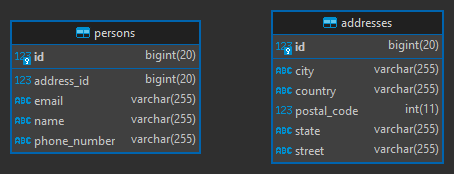
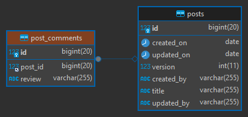

# [Proyecciones: Recuperar datos con Spring/Boot con mejor rendimiento (Spring Data Projections)](https://www.youtube.com/watch?v=64CjU6xNdx4)

- Tutorial tomado del canal de youtube de **SACAViX Tech**
- [Documentación Oficial de Spring Projections](https://docs.spring.io/spring-data/jpa/reference/repositories/projections.html)
- [Uso de Projections en proyecto spring-boot-web-crud]( https://github.com/magadiflo/spring-boot-web-crud.git)
- [La mejor forma de obtener una proyección DTO de Spring Data JPA](https://vladmihalcea.com/spring-jpa-dto-projection)

## ¿Qué es una proyección?

Es un mecanismo por el cual podemos obtener o acceder a elementos particulares de nuestro modelo de datos. **Las
proyecciones le permiten seleccionar solo las columnas que necesita para un caso de uso determinado.**

`Spring Data Projection` permite hacer uso de este mecanismo en Spring.

## Tipos de proyecciones

- Interfaz cerrada
- Interfaz abierta
- Basada en clase
- Basada en clase usando NamedQuery
- Proyección dinámica

## Dependencias

````xml
<!--Spring Boot 3.2.3-->
<!--Java 21-->
<dependencies>
    <dependency>
        <groupId>org.springframework.boot</groupId>
        <artifactId>spring-boot-starter-data-jpa</artifactId>
    </dependency>
    <dependency>
        <groupId>org.springframework.boot</groupId>
        <artifactId>spring-boot-starter-web</artifactId>
    </dependency>

    <dependency>
        <groupId>com.mysql</groupId>
        <artifactId>mysql-connector-j</artifactId>
        <scope>runtime</scope>
    </dependency>
    <dependency>
        <groupId>org.projectlombok</groupId>
        <artifactId>lombok</artifactId>
        <optional>true</optional>
    </dependency>
    <dependency>
        <groupId>org.springframework.boot</groupId>
        <artifactId>spring-boot-starter-test</artifactId>
        <scope>test</scope>
    </dependency>
</dependencies>
````

## Configuraciones del application.yml

````yml
server:
  port: 8080
  error:
    include-message: always

spring:
  application:
    name: spring-boot-jpa-projections

  datasource:
    url: jdbc:mysql://localhost:3306/db_spring_data_jpa
    username: admin
    password: magadiflo

  jpa:
    hibernate:
      ddl-auto: create-drop
    properties:
      hibernate:
        format_sql: true

logging:
  level:
    org.hibernate.SQL: DEBUG
````

## Entidades

````java

@Data
@Entity
@Table(name = "addresses")
public class Address {
    @Id
    @GeneratedValue(strategy = GenerationType.IDENTITY)
    private Long id;
    private String street;
    private String city;
    private String state;
    private Integer postalCode;
    private String country;
}
````

````java

@Data
@Entity
@Table(name = "persons")
public class Person {
    @Id
    @GeneratedValue(strategy = GenerationType.IDENTITY)
    private Long id;
    private String name;
    private String phoneNumber;
    private String email;
    private Long addressId;
}
````

## Creando tablas

Al ejecutar la aplicación, las tablas se crean automáticamente gracias a la configuración que establecimos en el
`application.yml`. A continuación se muestran el diagrama de las tablas generadas.



Aunque no definimos explícitamente la relación entre personas y direcciones, esa relación lo haremos a nivel de código,
por esa razón es que en la entidad `persons` establecimos el atributo `address_id` donde guardaremos la referencia
a la tabla `address`.

---

# Creando proyecciones

Utilizando el repositorio `IPersonRepository` implementamos los distintos tipos de proyecciones.

---

## Proyección cerrada

Como observamos, el método `getPersonLocation` retorna una interfaz de proyección cerrada `IPersonLocation`:

````java
public interface IPersonRepository extends JpaRepository<Person, Long> {
    // Using Closed Projection
    @Query(value = """
            SELECT p.name AS name, p.phone_number AS phoneNumber, a.street AS street
            FROM persons AS p
                INNER JOIN addresses AS a ON(p.address_id = a.id)
            WHERE p.id = :id
            """, nativeQuery = true)
    IPersonLocation getPersonLocation(@Param("id") Long personId);
}
````

La interfaz de proyección cerrada `IPersonLocation` define métodos en función de las columnas que retorna la
consulta `SQL` anterior.

Se deberá anteponer el `get` al nombre de cada método, por ejemplo, si en la consulta `SQL` tenemos el alias `name`,
entonces definimos el método `getName()` en la interfaz de proyección cerrada, del mismo modo se procederá con las
otras columnas:

````java

/**
 * Interface Closed Projection
 * <p>
 * Una interfaz de proyección cuyos métodos de acceso coinciden con las propiedades
 * del agregado de destino se considera una proyección cerrada.
 */
public interface IPersonLocation {
    String getName();

    String getPhoneNumber();

    String getStreet();
}
````

**IMPORTANTE**
> Es importante que en la `consulta SQL`, a cada columna le definamos un `Alias`, ese `Alias` deberá ser igual al
> atributo que definimos en la entidad. Por ejemplo, en la entidad `Person` definimos el atributo llamado `phoneNumber`,
> eso significa que el alias en la consulta `SQL` deberá tener el mismo nombre `phoneNumber`.

## Proyección abierta - con @Value

Todas las consultas serán las mismas, lo que cambia es el tipo de proyección que se retorna. En este caso, estamos
retornando una proyección abierta, ya que la interfaz `IPersonFullLocation` define un atributo con el `@Value`:

````java
public interface IPersonRepository extends JpaRepository<Person, Long> {
    // Using Open Projection
    @Query(value = """
            SELECT p.name AS name, p.phone_number AS phoneNumber, a.street AS street
            FROM persons AS p
                INNER JOIN addresses AS a ON(p.address_id = a.id)
            WHERE p.id = :id
            """, nativeQuery = true)
    IPersonFullLocation getPersonFullLocation(@Param("id") Long personId);
}
````

Usamos la anotación `@Value` e internamente usamos el `target` que contendrá el objeto consultado.

````java
/**
 * Interface Open Projection - with @Value
 * <p>
 * Los métodos de acceso en las interfaces de proyección también se pueden utilizar para
 * calcular nuevos valores mediante la anotación @Value.
 * <p>
 * Una interfaz de proyección que utiliza @Value es una proyección abierta. Spring Data no
 * puede aplicar optimizaciones de ejecución de consultas en este caso, porque la expresión
 * SpEL podría usar cualquier atributo de la raíz agregada.
 */
public interface IPersonFullLocation {
    @Value("#{target.name + ' ' + target.phoneNumber + ' ' + target.street}")
    String getFullLocation();
}
````

## Proyección abierta - con Default method

A diferencia de la anotación `@Value`, en este tipo de proyección retornado por la consulta, podemos hacer uso
del método por `default` que nos ofrece las interfaces en java:

````java
public interface IPersonRepository extends JpaRepository<Person, Long> {
    // Using a projection interface using a default method for custom logic
    @Query(value = """
            SELECT p.name AS name, p.phone_number AS phoneNumber, a.street AS street
            FROM persons AS p
                INNER JOIN addresses AS a ON(p.address_id = a.id)
            WHERE p.id = :id
            """, nativeQuery = true)
    IPersonLocationDefault getPersonLocationDefault(@Param("id") Long personId);
}
````

````java
/**
 * Interface Open Projection - with Default Method
 * <p>
 * Una interfaz de proyección que utiliza un método predeterminado para
 * lógica personalizada.
 * <p>
 * Este enfoque requiere que usted pueda implementar lógica basada exclusivamente en
 * los otros métodos de acceso expuestos en la interfaz de proyección.
 */
public interface IPersonLocationDefault {
    String getName();

    String getPhoneNumber();

    String getStreet();

    default String getFullLocation() {
        return getName() + ": " + getPhoneNumber() + " - " + getStreet();
    }
}
````

## Proyección basado en clase

Este tipo de proyección usa la interfaz `Tuple` importado de `jakarta.persistence`. Interfaz para extraer los elementos
de una tupla de resultados de consulta.

````java
// Class based
@Query(value = """
        SELECT p.name AS name, p.phone_number AS phoneNumber, a.street AS street
        FROM persons AS p
            INNER JOIN addresses AS a ON(p.address_id = a.id)
        WHERE p.id = :id
        """, nativeQuery = true)
Tuple getPersonLocationDTO(@Param("id") Long personId);
````

El resultado que nos retorne la consulta, será del tipo `Tuple`. Ahora, para tener un mejor control de los datos debemos
extraer el resultado de la tupla usando sus métodos como el `.get()`, y los valores rellenarlos en otra clase. En
nuestro caso, los valores contenidos en la tupla serán rellenados en el record siguiente:

````java
// Usado en la proyección que recupera una Tuple y los datos serán volcados a este record
public record PersonLocationDTO(String name, String phoneNumber, String street) {
}
````

Adelantándonos a lo que veremos más adelante en el controlador, de la siguiente manera poblaremos el record anterior
con los datos de la tuple:

````java

@GetMapping(path = "/class-based")
public PersonLocationDTO getSampleInterfaceClassBasedProjection() {
    Tuple tuple = this.personRepository.getPersonLocationDTO(1L);

    String name = tuple.get("name", String.class);
    String phoneNumber = tuple.get("phoneNumber", String.class);
    String street = tuple.get("street", String.class);

    return new PersonLocationDTO(name.toUpperCase(), phoneNumber.toUpperCase(), street.toUpperCase());
}
````

## Proyección usando Named Query

Esta consulta devolverá el record `PersonLocationDTO2`, pero la construcción de la consulta misma es lo que varía.
En este caso le estamos dando un valor a la anotación query de nombre `getPersonLocationDTONamingQuery`.

````java
/**
 * Using named query
 * <p>
 * El getPersonLocationDTONamingQuery, debe estar en una anotación dentro de su entidad
 * correspondiente
 */
@Query(name = "getPersonLocationDTONamingQuery", nativeQuery = true)
PersonLocationDTO2 getPersonLocationDTO2(@Param("id") Long personId);
````

Definiendo el record que devolverá la consulta anterior:

````java
// Using named query
public record PersonLocationDTO2(String name, String phoneNumber, String street) {
}
````

Ahora, debemos ir a la entidad `Person` y agregar las anotación `@NamedNativeQuery y @SqlResultSetMapping` cons sus
configuraciones:

````java

@NamedNativeQuery(
        name = "getPersonLocationDTONamingQuery",
        query = """
                SELECT p.name AS name, p.phone_number AS phoneNumber, a.street AS street
                FROM persons AS p
                    INNER JOIN addresses AS a ON(p.address_id = a.id)
                WHERE p.id = :id
                """,
        resultSetMapping = "PersonLocationDTO2Mapping"
)
@SqlResultSetMapping(
        name = "PersonLocationDTO2Mapping",
        classes = @ConstructorResult(
                targetClass = PersonLocationDTO2.class,
                columns = {
                        @ColumnResult(name = "name", type = String.class),
                        @ColumnResult(name = "phoneNumber", type = String.class),
                        @ColumnResult(name = "street", type = String.class)
                }
        )
)
@Data
@Entity
@Table(name = "persons")
public class Person {
    @Id
    @GeneratedValue(strategy = GenerationType.IDENTITY)
    private Long id;
    private String name;
    private String phoneNumber;
    private String email;
    private Long addressId;
}
````

Notar que en el `name` de la anotación `@NamedNativeQuery` es el mismo que definimos en el value de la anotación query.
En el `resultSetMapping` definimos el nombre `PersonLocationDTO2Mapping` que enlazará a la
anotación `@SqlResultSetMapping` a través de su `name`. En la anotación `@SqlResultSetMapping` definimos un
`targetClass` que en nuestro caso será el record que vimos en el apartado superior y las demás configuraciones se
sobreentiende.

## Proyección Dinámica

Hasta ahora, hemos utilizado el tipo de proyección como tipo de retorno o tipo de elemento de una colección. Sin
embargo, es posible que desee seleccionar el tipo que se utilizará en el momento de la invocación (lo que lo hace
dinámico). Para aplicar proyecciones dinámicas, utilice un método de consulta como el que se muestra en el siguiente
ejemplo:

````java
/**
 * Dynamically, usando proyección genérica.
 * <p>
 * El class type podría ser cualquier clase que hemos definido en las otras consultas,
 * ya que estamos trabajando todas sobre la misma consulta.
 */
@Query(value = """
        SELECT p.name AS name, p.phone_number AS phoneNumber, a.street AS street
        FROM persons AS p
            INNER JOIN addresses AS a ON(p.address_id = a.id)
        WHERE p.id = :id
        """, nativeQuery = true)
<T> T getPersonLocationDynamically(@Param("id") Long personId, Class<T> type);
````

Aquí definimos otra proyección dinámica, esta vez nos retorna una colección:

````java
public interface IPersonRepository extends JpaRepository<Person, Long> {
    @Query(value = """
            SELECT p.name AS name, p.phone_number AS phoneNumber, a.street AS street
            FROM persons AS p
                INNER JOIN addresses AS a ON(p.address_id = a.id)
            WHERE p.name LIKE %:name%
            """, nativeQuery = true)
    <T> Collection<T> getPersonLocationDynamicallyList(@Param("name") String name, Class<T> type);
}
````

## Creando métodos del rest controller

Para agilizar la creación del proyecto de ejemplo, utilizaremos el repositorio directamente en el controlador, pero
**¡OJO! Eso no se deben hacer, debemos usar una clase de servicio con su interfaz**.

````java

@RequiredArgsConstructor
@RestController
@RequestMapping(path = "/api/v1/persons")
public class PersonRestController {

    /**
     * Como buena práctica se debe trabajar con servicios, pero por simplificar el
     * ejemplo, lo haremos directamente con el repositorio.
     */
    private final IPersonRepository personRepository;

    @GetMapping(path = "/interface-closed")
    public IPersonLocation getSampleInterfaceClosedProjection() {
        return this.personRepository.getPersonLocation(1L);
    }

    @GetMapping(path = "/interface-open")
    public IPersonFullLocation getSampleInterfaceOpenProjection() {
        return this.personRepository.getPersonFullLocation(1L);
    }

    @GetMapping(path = "/interface-open-default-method")
    public IPersonLocationDefault getSampleInterfaceOpenDefaultMethodProjection() {
        return this.personRepository.getPersonLocationDefault(1L);
    }

    @GetMapping(path = "/class-based")
    public PersonLocationDTO getSampleInterfaceClassBasedProjection() {
        Tuple tuple = this.personRepository.getPersonLocationDTO(1L);

        String name = tuple.get("name", String.class);
        String phoneNumber = tuple.get("phoneNumber", String.class);
        String street = tuple.get("street", String.class);

        return new PersonLocationDTO(name.toUpperCase(), phoneNumber.toUpperCase(), street.toUpperCase());
    }

    @GetMapping(path = "/class-based-named-query")
    public PersonLocationDTO2 getSampleInterfaceClassBasedNQProjection() {
        return this.personRepository.getPersonLocationDTO2(1L);
    }

    @GetMapping(path = "/dinamically")
    public Object getSampleInterfaceClassBaseDinamically() {
        return this.personRepository.getPersonLocationDynamically(1L, IPersonLocation.class);
    }

    @GetMapping(path = "/dinamically-list")
    public List<IPersonLocation> getSampleInterfaceClassBaseDinamicallyList() {
        return (List<IPersonLocation>) this.personRepository.getPersonLocationDynamicallyList("per", IPersonLocation.class);
    }

}
````

## Resultados

### Interfaz cerrada

````bash
$  curl -v http://localhost:8080/api/v1/persons/interface-closed | jq

>
< HTTP/1.1 200
<
{
  "name": "Persona 0",
  "street": "Street 0",
  "phoneNumber": "920632480"
}
````

### Interfaz abierta

````bash
$ curl -v http://localhost:8080/api/v1/persons/interface-open | jq

>
< HTTP/1.1 200
<
{
  "fullLocation": "Persona 0 920632480 Street 0"
}
````

### Interfaz abierta con métodos por default

````bash
$ curl -v http://localhost:8080/api/v1/persons/interface-open-default-method | jq

>
< HTTP/1.1 200
<
{
  "name": "Persona 0",
  "street": "Street 0",
  "phoneNumber": "920632480",
  "fullLocation": "Persona 0: 920632480 - Street 0"
}
````

### Basada en clase

````bash
$ url -v http://localhost:8080/api/v1/persons/class-based | jq

>
< HTTP/1.1 200
<
{
  "name": "PERSONA 0",
  "phoneNumber": "920632480",
  "street": "STREET 0"
}
````

### Basada en clase con named query

````bash
$ curl -v http://localhost:8080/api/v1/persons/class-based-named-query | jq

>
< HTTP/1.1 200
<
{
  "name": "Persona 0",
  "phoneNumber": "920632480",
  "street": "Street 0"
}
````

### Dinamically

````bash
$ curl -v http://localhost:8080/api/v1/persons/dinamically | jq

>
< HTTP/1.1 200
<

{
  "name": "Persona 0",
  "street": "Street 0",
  "phoneNumber": "920632480"
}
````

### Dinamically List

````bash
$ curl -v http://localhost:8080/api/v1/persons/dinamically-list | jq

< HTTP/1.1 200
<
[
  {
    "name": "Persona 0",
    "street": "Street 0",
    "phoneNumber": "920632480"
  },
  {
    "name": "Persona 1",
    "street": "Street 1",
    "phoneNumber": "921632481"
  },
  {
    "name": "Persona 2",
    "street": "Street 2",
    "phoneNumber": "922632482"
  },
  {
    "name": "Persona 3",
    "street": "Street 3",
    "phoneNumber": "923632483"
  },
  {
    "name": "Persona 4",
    "street": "Street 4",
    "phoneNumber": "924632484"
  },
  {
    "name": "Persona 5",
    "street": "Street 5",
    "phoneNumber": "925632485"
  },
  {
    "name": "Persona 6",
    "street": "Street 6",
    "phoneNumber": "926632486"
  },
  {
    "name": "Persona 7",
    "street": "Street 7",
    "phoneNumber": "927632487"
  },
  {
    "name": "Persona 8",
    "street": "Street 8",
    "phoneNumber": "928632488"
  }
]
````

---

# [La mejor forma de obtener una proyección DTO de Spring Data JPA](https://vladmihalcea.com/spring-jpa-dto-projection)

Enlace del articulo publicado en LinkedIn por **Vlad Mihalcea**

---

## Por qué utilizar proyecciones DTO

Como expliqué en este artículo, **las proyecciones DTO le permiten seleccionar solo las columnas que necesita para un
caso de uso determinado.**

A lo largo de mis compromisos de consultoría y capacitación, puedo ver que, muchas veces, los desarrolladores obtienen
más de lo necesario y la mejor manera de solucionar este problema es utilizar `paginación y proyecciones`.

Si bien **la paginación le permite reducir la cantidad de registros en el conjunto de resultados, las proyecciones le
permiten reducir la cantidad de columnas que está recuperando**, y esto puede ayudarlo a reducir el tiempo de respuesta
de la consulta.

## ¿Qué es una proyección DTO?

Una `proyección SQL` es básicamente una consulta que proporciona una **lista de columnas** en la cláusula `SELECT`.

Una `proyección DTO` es un objeto Java que **contiene los valores de columna que fueron obtenidos por una consulta de
proyección SQL determinada.**

**La proyección DTO puede ser** un `POJO` (Plain Old Java Object), un `JPA Tuple` o un `Java Record`, y podemos
recuperar todos esos tipos de proyección DTO utilizando Spring Data JPA.

## Entidades

Para este nuevo apartado, usaremos las siguientes entidades relacionadas:

````java

@Data
@Entity
@Table(name = "posts")
public class Post {
    @Id
    @GeneratedValue(strategy = GenerationType.IDENTITY)
    private Long id;
    private String title;
    private LocalDate createdOn;
    private String createdBy;
    private LocalDate updatedOn;
    private String updatedBy;
    private Integer version;
}
````

````java

@Data
@Entity
@Table(name = "post_comments")
public class PostComment {
    @Id
    @GeneratedValue(strategy = GenerationType.IDENTITY)
    private Long id;
    private String review;

    @ManyToOne(fetch = FetchType.LAZY)
    @JoinColumn(name = "post_id")
    private Post post;
}
````

[**IMPORTANTE (click aquí)**](https://vladmihalcea.com/the-best-way-to-handle-the-lazyinitializationexception/)

> Las asociaciones del tipo `@ManyToOne` y `@OneToOne` (básicamente las que terminan en `...One`), son del tipo
> `FetchType.EAGER` de manera `predeterminada`.
>
> Según el autor de este apartado, menciona: *La recuperación EAGER significa que las asociaciones siempre se recuperan
> junto con su entidad principal. En realidad, la recuperación EAGER es muy mala desde una perspectiva de rendimiento
> porque es muy difícil idear una política de recuperación global que se aplique a todos los casos de uso empresarial
> que pueda tener en su aplicación empresarial.*
>
> Una vez que tienes una asociación EAGER, no hay manera de convertirla en LAZY. De esta manera, la asociación siempre
> se recuperará incluso si el usuario no la necesita necesariamente para un caso de uso particular. Peor aún, si olvida
> especificar que una asociación EAGER debe ser JOIN FETCH mediante una consulta JPQL, Hibernate emitirá una selección
> secundaria para cada asociación no inicializada, lo que generará problemas de consulta N+1.
>
> Desafortunadamente, JPA 1.0 decidió que `@ManyToOne y @OneToOne` deberían usar `FetchType.EAGER` de manera
> predeterminada, por lo que ahora debe **marcar explícitamente estas dos asociaciones como** `FetchType.LAZY`.
>
> Por esta razón, es mejor utilizar asociaciones `LAZY`. Una asociación LAZY se expone a través de un Proxy, lo que
> **permite que la capa de acceso a datos cargue la asociación según demanda.** Desafortunadamente, las asociaciones
> `LAZY` pueden generar `LazyInitializationException`.
>
> Para solucionar el problema del `LazyInitializationException` ver en estos enlaces:
> [JOIN FETCH to the rescue](https://vladmihalcea.com/the-best-way-to-handle-the-lazyinitializationexception/) y
> [DTO projection to the rescue](https://vladmihalcea.com/the-best-way-to-handle-the-lazyinitializationexception/)

A continuación se muestran las tablas generadas en la base de datos a partir de las entidades anteriores:



## Repositorios

````java
public interface IPostRepository extends JpaRepository<Post, Long> {
}
````

````java
public interface IPostCommentRepository extends JpaRepository<PostComment, Long> {
}
````

## Obteniendo un Tuple projection

Esta opción consiste en mapear la proyección SQL grabando un contenedor JPA Tuple como este:

````java
public interface IPostCommentRepository extends JpaRepository<PostComment, Long> {
    @Query("""
            SELECT p.id AS id,
                    p.title AS title,
                    pc.review AS review
            FROM PostComment AS pc
                JOIN pc.post AS p
            WHERE p.title LIKE :postTitle
            ORDER BY pc.id
            """)
    List<Tuple> findCommentTupleByTitle(@Param("postTitle") String postTitle);
}
````

**NOTA**

> La consulta definida en el `@Query` anterior es una consulta `JPQL`

````java

@RequiredArgsConstructor
@Slf4j
@RestController
@RequestMapping(path = "/api/v1/post-comments")
public class PostCommentController {

    private final IPostCommentRepository postCommentRepository;

    @GetMapping(path = "/tuples")
    public ResponseEntity<Map<String, Object>> getPostWithCommentByTitle(@RequestParam String postTitle) {
        List<Tuple> postWithPostComments = this.postCommentRepository.findCommentTupleByTitle(postTitle);
        HashMap<String, Object> response = new HashMap<>();

        if (!postWithPostComments.isEmpty()) {
            Tuple postTuple = postWithPostComments.getFirst();

            Long postId = postTuple.get("id", Long.class);
            String title = postTuple.get("title", String.class);

            List<String> reviewList = new ArrayList<>();
            postWithPostComments.forEach(tuple -> {
                String review = tuple.get("review", String.class);
                reviewList.add(review);
            });

            response.put("id", postId);
            response.put("title", title);
            response.put("reviews", reviewList);
        }

        return ResponseEntity.ok(response);
    }

}
````

Realizamos la petición al endpoint enviándole el título del post como parámetro solicitado:

````bash
$ curl -v -G --data "postTitle=Revolution+Angular+17" http://localhost:8080/api/v1/post-comments/tuples | jq

>
< HTTP/1.1 200
<
{
  "reviews": [
    "Se vienen nuevos cambios",
    "La nueva sintaxis parece se ve más entendible"
  ],
  "id": 2,
  "title": "Revolution Angular 17"
}
````

La consulta `SQL` generada en el `LOG` del ide IntelliJ IDEA es el siguiente:

````sql
select
        p1_0.id,
        p1_0.title,
        pc1_0.review 
    from
        post_comments pc1_0 
    join
        posts p1_0 
            on p1_0.id=pc1_0.post_id 
    where
        p1_0.title like replace(?, '\\', '\\\\') 
    order by
        pc1_0.id
````

Sin embargo, si bien el `Tuple` nos permite recuperar los valores de las columnas por su alias de columna, aún
necesitamos realizar una conversión de tipos, y esa es una limitación importante, ya que el cliente tendrá que saber de
antemano el tipo real al que desea convertir.

Sería mucho mejor si el contenedor de proyección fuera seguro.

## Obtención de una proyección Proxy basada en interfaz

Con Spring Data JPA, podemos mapear la proyección SQL a un DTO que implemente una interfaz, como la siguiente:

````java
public interface IPostCommentSummary {
    Long getId();

    String getTitle();

    String getReview();
}
````

Los métodos de la interfaz `IPostCommentSummary` definen el nombre del alias de la columna de proyección asociada y el
tipo que debe utilizarse para emitir el valor de la columna de proyección.

Entre bastidores, `Spring Data JPA` utilizará un `Proxy` que implemente esta interfaz cuando devuelva las referencias a
objetos `IPostCommentSummary`.

En nuestro caso, podemos definir el método `findCommentSummaryByTitle` del repositorio para que utilice la interfaz
`IPostCommentSummary` mencionada anteriormente de la siguiente manera:

````java
public interface IPostCommentRepository extends JpaRepository<PostComment, Long> {
    /* other methods */

    @Query("""
            SELECT p.id AS id,
                    p.title AS title,
                    pc.review AS review
            FROM PostComment AS pc
                JOIN pc.post AS p
            WHERE p.title LIKE :postTitle
            ORDER BY pc.id
            """)
    List<IPostCommentSummary> findCommentSummaryByTitle(@Param("postTitle") String postTitle);
}
````

Y al llamar al método `findCommentSummaryByTitle` del repositorio, ya no tenemos que convertir los valores de
proyección:

````java

@RequiredArgsConstructor
@Slf4j
@RestController
@RequestMapping(path = "/api/v1/post-comments")
public class PostCommentController {

    private final IPostCommentRepository postCommentRepository;

    /* other methods */
    @GetMapping(path = "/interface-based-projection")
    public ResponseEntity<Map<String, Object>> getCommentSummaryByTitle(@RequestParam String postTitle) {
        List<IPostCommentSummary> postCommentSummaries = this.postCommentRepository.findCommentSummaryByTitle(postTitle);
        HashMap<String, Object> response = new HashMap<>();

        if (!postCommentSummaries.isEmpty()) {
            IPostCommentSummary projectionFirst = postCommentSummaries.getFirst();

            Long postId = projectionFirst.getId();
            String title = projectionFirst.getTitle();

            List<String> reviewList = new ArrayList<>();
            postCommentSummaries.forEach(projection -> {
                String review = projection.getReview();
                reviewList.add(review);
            });

            response.put("id", postId);
            response.put("title", title);
            response.put("reviews", reviewList);
        }
        return ResponseEntity.ok(response);
    }
}
````

Mucho mejor, ¿verdad?

Sin embargo, **también existe una desventaja de utilizar la proyección Proxy. No podemos proporcionar una
implementación específica para `equals` y `hashCode`, y esto limita su usabilidad.**

Por el momento, vamos a ejecutar el proyecto y veamos el resultado obtenido:

````bash
$ curl -v -G --data "postTitle=Revolution+Angular+17" http://localhost:8080/api/v1/post-comments/interface-based-projection | jq

>
< HTTP/1.1 200
<
{
  "reviews": [
    "Se vienen nuevos cambios",
    "La nueva sintaxis parece se ve más entendible"
  ],
  "id": 2,
  "title": "Revolution Angular 17"
}
````

SQL generado en consola del IDE:

````sql
select
        p1_0.id,
        p1_0.title,
        pc1_0.review 
    from
        post_comments pc1_0 
    join
        posts p1_0 
            on p1_0.id=pc1_0.post_id 
    where
        p1_0.title like replace(?, '\\', '\\\\') 
    order by
        pc1_0.id
````

## Obteniendo un Record DTO projection

Si bien la proyección Proxy es una buena solución, en realidad es tan fácil usar un `Java record` como el siguiente:

````java
public record PostCommentRecord(Long id, String title, String review) {
}
````

`PostCommentRecord` tiene una definición muy compacta, pero brinda soporte para los métodos `equals`, `hashCode`
y `toString`.

Para usar `PostCommentRecord` en nuestra proyección, **necesitamos cambiar la consulta `JPQL` para usar la expresión
constructora**, como se ilustra en el siguiente ejemplo:

````java
public interface IPostCommentRepository extends JpaRepository<PostComment, Long> {
    /* other methods */
    @Query("""
            SELECT new dev.magadiflo.projections.app.persistence.projections.PostCommentRecord(p.id AS id,
                                        p.title AS title,
                                        pc.review AS review)
            FROM PostComment AS pc
                JOIN pc.post AS p
            WHERE p.title LIKE :postTitle
            ORDER BY pc.id
            """)
    List<PostCommentRecord> findCommentRecordByTitle(@Param("postTitle") String postTitle);
}
````

Para usar el record `PostCommentRecord` dentro de la consulta `JPQL` debemos especificar el nombre completo de la clase.
En nuestro caso, si vemos la consulta JPQL anterior, veremos que estamos usamos el nombre completo de la clase, tal
como sigue:

````
dev.magadiflo.projections.app.persistence.projections.PostCommentRecord(...)
````

Ahora, existen el proyecto [Hypersistence Utils](https://github.com/vladmihalcea/hypersistence-utils) que proporciona
un `ClassImportIntegrator` con el cual podemos usar el nombre de clase simple en las consultas JPQL de expresión del
constructor. **En el tutorial se muestra su configuración, pero en nuestro caso, como no tenemos dicha dependencia,
y además no quiero agregar más complejidad, seguiremos utilizando el nombre completo de la clase para usarlo dentro de
la consulta `JPQL`.**

Ahora, al llamar al método `findCommentRecordByTitle`, podemos ver que obtenemos el resultado esperado:

````java

@RequiredArgsConstructor
@Slf4j
@RestController
@RequestMapping(path = "/api/v1/post-comments")
public class PostCommentController {
    /* other methods */
    @GetMapping(path = "/record-dto-projection")
    public ResponseEntity<Map<String, Object>> getCommentRecordByTitle(@RequestParam String postTitle) {
        List<PostCommentRecord> postCommentRecords = this.postCommentRepository.findCommentRecordByTitle(postTitle);
        HashMap<String, Object> response = new HashMap<>();

        if (!postCommentRecords.isEmpty()) {
            PostCommentRecord recordFirst = postCommentRecords.getFirst();

            //-------------- Ejemplo para verificar igualdad --------
            PostCommentRecord recordCompare = new PostCommentRecord(2L, "Revolution Angular 17", "Se vienen nuevos cambios");
            log.info("¿Record obtenido de la BD es igual al record creado en código?: {}", recordFirst.equals(recordCompare));
            //--------------

            Long postId = recordFirst.id();
            String title = recordFirst.title();

            List<String> reviewList = new ArrayList<>();
            postCommentRecords.forEach(record -> {
                String review = record.review();
                reviewList.add(review);
            });

            response.put("id", postId);
            response.put("title", title);
            response.put("reviews", reviewList);
        }
        return ResponseEntity.ok(response);
    }
}
````

Y, a diferencia del Proxy basado en interfaz, la igualdad funciona como se esperaba ahora. **Por lo tanto, la solución
de Java Record es mucho mejor que la de Proxy basada en la interfaz.**

````
 //-------------- Ejemplo para verificar igualdad --------
PostCommentRecord recordCompare = new PostCommentRecord(2L, "Revolution Angular 17", "Se vienen nuevos cambios");
log.info("¿Record obtenido de la BD es igual al record creado en código?: {}",recordFirst.equals(recordCompare));
//--------------
````

````bash
$ curl -v -G --data "postTitle=Revolution+Angular+17" http://localhost:8080/api/v1/post-comments/record-dto-projection | jq

>
< HTTP/1.1 200
<
{
  "reviews": [
    "Se vienen nuevos cambios",
    "La nueva sintaxis parece se ve más entendible"
  ],
  "id": 2,
  "title": "Revolution Angular 17"
}
````

Consulta `SQL` generado:

````sql
select
        p1_0.id,
        p1_0.title,
        pc1_0.review 
    from
        post_comments pc1_0 
    join
        posts p1_0 
            on p1_0.id=pc1_0.post_id 
    where
        p1_0.title like replace(?, '\\', '\\\\') 
    order by
        pc1_0.id
````

## Obteniendo un POJO DTO projection

Sin embargo, si desea tener control absoluto sobre sus clases DTO, entonces un POJO es la solución más flexible.

En nuestro caso, podemos definir la siguiente clase `PostCommentDTO`:

````java
public class PostCommentDTO {
    private final Long id;
    private final String title;
    private final String review;

    public PostCommentDTO(Long id, String title, String review) {
        this.id = id;
        this.title = title;
        this.review = review;
    }

    public Long getId() {
        return id;
    }

    public String getTitle() {
        return title;
    }

    public String getReview() {
        return review;
    }

    @Override
    public boolean equals(Object o) {
        if (this == o) return true;
        if (o == null || getClass() != o.getClass()) return false;
        PostCommentDTO that = (PostCommentDTO) o;
        return Objects.equals(id, that.id) && Objects.equals(title, that.title) && Objects.equals(review, that.review);
    }

    @Override
    public int hashCode() {
        return Objects.hash(id, title, review);
    }
}
````

Y, al igual que con la `proyección Java Record`, podemos obtener el `PostCommentDTO` utilizando la función de expresión
del constructor `JPQL`:

````java
public interface IPostCommentRepository extends JpaRepository<PostComment, Long> {
    /* other methods */
    @Query("""
            SELECT new dev.magadiflo.projections.app.persistence.projections.PostCommentDTO(p.id AS id,
                                        p.title AS title,
                                        pc.review AS review)
            FROM PostComment AS pc
                JOIN pc.post AS p
            WHERE p.title LIKE :postTitle
            ORDER BY pc.id
            """)
    List<PostCommentDTO> findCommentDTOByTitle(@Param("postTitle") String postTitle);
}
````

Y, al llamar al método `findCommentDTOByTitle`, la consulta `JPQL` subyacente va a mapear la proyección del
registro SQL al objeto Java `PostCommentDTO`:

````java

@RequiredArgsConstructor
@Slf4j
@RestController
@RequestMapping(path = "/api/v1/post-comments")
public class PostCommentController {
    /* other codes */
    @GetMapping(path = "/pojo-dto-projection")
    public ResponseEntity<Map<String, Object>> getCommentDTOByTitle(@RequestParam String postTitle) {
        List<PostCommentDTO> postCommentDTOS = this.postCommentRepository.findCommentDTOByTitle(postTitle);
        HashMap<String, Object> response = new HashMap<>();

        if (!postCommentDTOS.isEmpty()) {
            PostCommentDTO dtoFirst = postCommentDTOS.getFirst();

            //-------------- Ejemplo para verificar igualdad --------
            PostCommentDTO dtoCompare = new PostCommentDTO(2L, "Revolution Angular 17", "Se vienen nuevos cambios");
            log.info("¿POJO DTO obtenido de la BD es igual al POJO DTO creado en código?: {}", dtoFirst.equals(dtoCompare)); // True
            //--------------

            Long postId = dtoFirst.getId();
            String title = dtoFirst.getTitle();

            List<String> reviewList = new ArrayList<>();
            postCommentDTOS.forEach(dto -> {
                String review = dto.getReview();
                reviewList.add(review);
            });

            response.put("id", postId);
            response.put("title", title);
            response.put("reviews", reviewList);
        }
        return ResponseEntity.ok(response);
    }
}
````

````bash
$ curl -v -G --data "postTitle=Revolution+Angular+17" http://localhost:8080/api/v1/post-comments/pojo-dto-projection | jq

>
< HTTP/1.1 200
<
{
  "reviews": [
    "Se vienen nuevos cambios",
    "La nueva sintaxis parece se ve más entendible"
  ],
  "id": 2,
  "title": "Revolution Angular 17"
}
````

SQL generado:

````sql
select
        p1_0.id,
        p1_0.title,
        pc1_0.review 
    from
        post_comments pc1_0 
    join
        posts p1_0 
            on p1_0.id=pc1_0.post_id 
    where
        p1_0.title like replace(?, '\\', '\\\\') 
    order by
        pc1_0.id
````